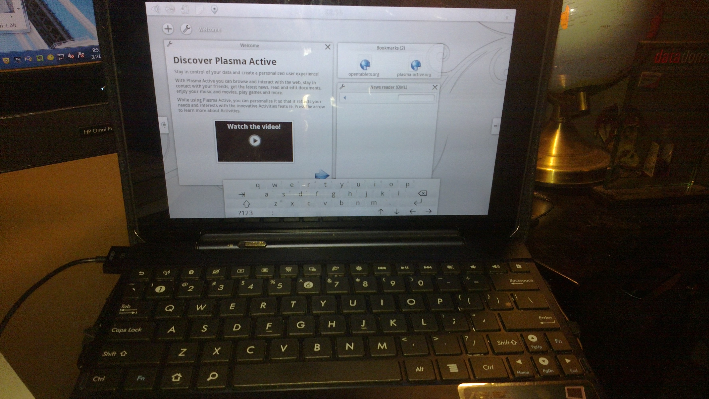

tf300_plasma
============

Plasma Active Image for ASUS TF300T tablet

This project aims to create a custom image for the TF300T tablet with Plasma Active project from KDE installed.

The idea came from cb22's ArchLinux project which successfully runs native linux on this table.

To learn more about Plasma Active and Mer Linux you can visit the below sites: 
<a href="http://plasma-active.org">Plasma Active</a> 
<a href="http://merproject.org">Mer</a> 

TODO:
Fix some of the display issues 
<ul><li>Hardware Cursor?</li><li>Keyboard MousePad</li>
<li>Display Lock/Suspend reboots machine</li>
</ul> 
Get Wi-Fi setup 
Check Bluetooth, Sound 

Fixed the Kernel. It requires a linaro arm gcc. The gcc arm cross-compiler that comes with Ubuntu does not work!

<h2> PRE-INSTALLATION </h2>

If you would just like to try it out without having to build all of this, you can visit the following link 
<a href="http://iamboke.blogspot.com/2013/03/plasma-active-mer-on-asus-transformer.html">here</a> and click on update.zip to be re-directed to the download server.

<h2> INSTALLATION </h2>

You will need cmake and gcc installed before beginning.

<pre>sudo apt-get install cmake gcc </pre>

Additionally, you will need to install libz.so.1 if you are running an x64 machine

<pre>sudo apt-get install lib32z1</pre>

CD into the install directory and run the following 

<pre>./install.sh</pre>

It will ask for your root password at certain times.

<strong> The default credentials are: </strong>
<pre>
mer/mer
root/mer
</pre>

<h2> NOTES </h2>
<ul>
<li>I could only get the kernel to actually run when I used the x86 version of the linaro                    gcc for arm</li>
<li>The ARCH type is armhf, don't try to use armel when compiling (like me. Google is fundamental...)</li>
</ul>
<h2> Special Thanks </h2>

I would like to thank these people who laid the foundation to start this project
cb22 - Modified the TF300T source, made a working linux distribution with WiFI support on the tablet
hach-que - Who's instructions I'm following to build the kernel. Also, Drwowe who created the blobpack for TF300T

-Others-
XDA-developers
Plasma Active
Mer
